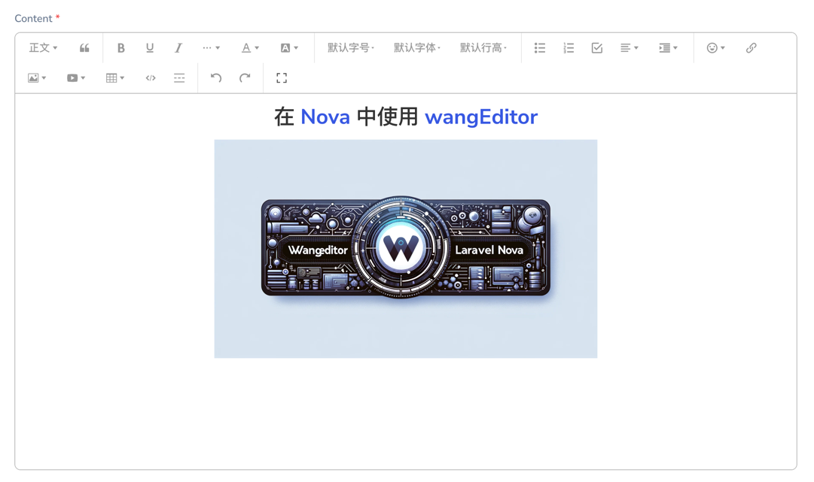

# A Laravel Nova field for wangEditor


## 介绍

这是一个为 Laravel Nova 提供的 wangEditor 字段扩展。wangEditor 是一款轻量级的富文本编辑器，适用于现代web应用程序。此扩展旨在简化在
Laravel Nova 中集成和使用 wangEditor。

## 演示



## 前提条件

- [Laravel](https://laravel.com) >= 9
- [Laravel Nova](https://nova.laravel.com) >= 4

## 如何安装

在您的 Laravel 安装根目录下运行：

```bash
composer require xuchunyang/wangeditor
```

## 注册字段

在您的 Nova/Resource.php 文件中，按如下方式添加字段：

```php
Wangeditor::make('Content'),
```

更复杂的示例，可以设置编辑器的大小，并配置图片上传地址：

```php
Wangeditor::make('Content')
    ->stacked()
    ->fullWidth()
    ->onlyOnForms()
    ->placeholder('请输入内容')
    ->rules('required')
    ->withHeight('500px')
    ->withToolbarConfig([])
    ->withEditorConfig([
        'MENU_CONF' => [
            'uploadImage' => [
                'server' => '/upload-image-for-wang-editor',
            ],
        ],
    ])
```

## 使用说明

- 安装后设置：安装此扩展后，您可以在 Nova 资源中直接引用 Wangeditor 字段。
- 配置编辑器：根据需要定制编辑器的外观和功能，例如工具栏按钮、占位符文本等。
- 适用场景：适用于需要富文本编辑功能的表单，如内容管理、文章撰写等。
